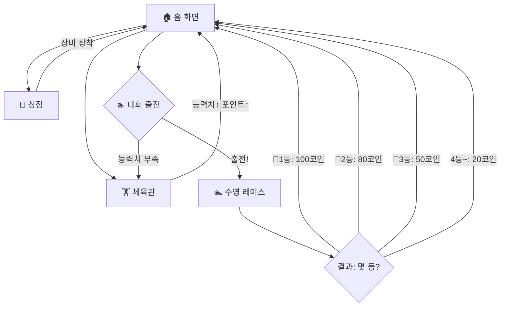

# 🏆 수영 챔피언: 성장형 스포츠 게임 - 기획안 (v3.2)

> v3.1 대비 변경: **v3.1 카메라 줌 & 추격 물리 완료**, **v3.2 체육관 훈련 성장 가이드(Option B) 예정안 문서 추가**

### 🚨 핵심 개발 & 협업 원칙 (Core Collaboration Rule)
> ⚠️ **선(先) 논의 후(後) 코드 수정 원칙**:
> 향후 어떤 신규 기능 추가, 밸런스 조정, 디자인 변경, 버그 수정 요청이 있더라도 **절대로 코드를 즉시 수정하지 않는다.**
> 항상 먼저 hikary님과 아이디어 및 해결 방안에 대해 충분히 논의하고, 확정된 기획안 및 수정안을 마크다운 문서(`README.md` / `implementation_plan.md`)에 기록한 후에만 코드를 수정한다.

---

## 1. 기본 컨셉

**사람 캐릭터**가 체육관에서 다양한 운동으로 **조금씩 근육을 키우고 성장**하며, 10단계 수영 대회(실내수영장 → 호수 → 강 → 바다 → 대양)에 출전. **등수에 따라 상금**을 받고 장비를 업그레이드하며 **최종 챔피언**을 향해 나아가는 교육용 성장 게임.

### 확정 사항
- ✅ 캐릭터: 사람 (기존 동물 에셋 폐기)
- ✅ 디자인 에셋: 구글 스티치로 생성
- ✅ 모바일 퍼스트 (세로 모드, 터치)
- ✅ 체육관 훈련 다양화 (10종)
- ✅ 대회 10단계, 등수별 상금
- ✅ 외형 10단계 점진적 성장
- ✅ **배포 환경**: GitHub Pages (`https://hikary83.github.io/sunny/`) 세팅 완료!
- ✅ **데이터 저장 & 기기 연동**: Firebase 연동 + 로그인 없는 어린이용 **'6자리 이어하기 코드' (`SWIM-XXXX`)** 지원 (스마트폰 ↔ 아이패드 ↔ PC 어디서든 이어하기)
- ✅ BGM/효과음은 코딩 완료 후 별도 추가
- ✅ 기존 코드 활용 가능한 부분은 재활용

---

## 2. 게임 흐름



---

## 3. 캐릭터 시스템 👤

### 3-1. 캐릭터 생성
- **외형**: 남자아이 / 여자아이 (2종)
- **이름**: 미리 준비된 닉네임 목록에서 선택 (모바일 편의)

### 3-2. 능력치 & 레벨

#### 4대 능력치
| 능력치 | 설명 | 주요 훈련 |
|--------|------|-----------|
| 💪 근력 | 수영 파워 | 펀칭, 역기, 연타 |
| 🫀 지구력 | 체력 소모 감소 | 스트레칭, 줄넘기, 리듬 |
| ⚡ 스피드 | 최고 속도 | 반응속도, 장애물달리기 |
| 🧠 집중력 | 이벤트 성공률 | 기억력, 수영폼 |

#### 레벨 시스템
- **레벨** = 4개 능력치 합산 ÷ 4 (소수점 버림)
- 레벨이 오를 때마다 외형이 변화!

| 레벨 | 능력치 합산 | 해금 |
|------|------------|------|
| Lv.1 | 4~7 | 시작 |
| Lv.2 | 8~11 | 대회 1 해금 |
| Lv.3 | 12~15 | 대회 2 해금, 훈련 2단계 해금 |
| Lv.4 | 16~19 | 대회 3 해금 |
| Lv.5 | 20~23 | 대회 4 해금, 훈련 3단계 해금 |
| Lv.6 | 24~27 | 대회 5~6 해금 |
| Lv.7 | 28~31 | 대회 7 해금 |
| Lv.8 | 32~35 | 대회 8 해금 |
| Lv.9 | 36~39 | 대회 9 해금 |
| Lv.10 | 40+ | 대회 10(최종) 해금 |

### 3-3. 외형 10단계 점진 성장 🧍→🏊

> **핵심**: 레벨이 오를 때마다 캐릭터가 **눈에 보이게 조금씩** 달라진다!

| 레벨 | 체형 변화 | 키 변화 | 안색 | 한마디 |
|------|-----------|---------|------|--------|
| Lv.1 | 빼빼 마른 체형 | 기본 (100%) | 창백 | "운동 시작이다!" |
| Lv.2 | 아주 살짝 탄탄 | 101% | 약간 혈색 | "조금 튼튼해진 느낌?" |
| Lv.3 | 어깨가 조금 넓어짐 | 103% | 건강한 살구색 | "슬슬 몸이 만들어지네!" |
| Lv.4 | 팔에 살짝 근육 라인 | 105% | 건강한 살구색 | "오~ 팔뚝 좀 봐!" |
| Lv.5 | 상체 탄탄, 복근 윤곽 | 108% | 햇볕에 탄 피부 | "제법 운동선수 같은데?" |
| Lv.6 | 넓은 어깨, 뚜렷한 근육 | 110% | 햇볕에 탄 피부 | "수영선수 체형이다!" |
| Lv.7 | 역삼각형 상체 | 113% | 구릿빛 | "대회 나가도 되겠는걸!" |
| Lv.8 | 뚜렷한 식스팩 | 115% | 구릿빛 | "프로 선수 뺨치네!" |
| Lv.9 | 프로 수영선수 체형 | 118% | 구릿빛 | "전국구 선수의 몸이다!" |
| Lv.10 | 완벽한 챔피언 피지컬 | 120% | 빛나는 구릿빛 | "전설의 챔피언 탄생!" |

> [!TIP]
> **구현 팁**: 5개의 기본 바디 스프라이트(Lv.1, 3, 5, 7, 10)를 스티치로 만들고, 중간 레벨은 **캔버스 스케일링(키)** + **색조 변경(안색)**으로 처리하면 에셋 수를 줄이면서도 10단계 느낌을 줄 수 있습니다.

---

## 4. 체육관 훈련 시스템 🏋️ (10종)

### 🖱️ A. 마우스 운동 (근력·스피드 ↑)

| 단계 | 운동 이름 | 미션 | 보상 |
|------|-----------|------|------|
| 1단계 | 🥊 펀칭 연습 | 샌드백/과녁 터치해서 때리기 | 포인트 1~2 |
| 2단계 | 🏋️ 역기 들기 | 역기를 꾹 눌러 위로 드래그 | 포인트 2~3 |
| 3단계 | 🏃 장애물 달리기 | 트랙을 벽에 안 닿고 통과 | 포인트 3~5 |

### ⌨️ B. 키보드 운동 (지구력 ↑)

| 단계 | 운동 이름 | 미션 | 보상 |
|------|-----------|------|------|
| 1단계 | 🧘 스트레칭 | 알파벳/한글 자음 하나씩 누르기 | 포인트 1~2 |
| 2단계 | 🪢 줄넘기 | 짧은 단어 타이핑 | 포인트 2~3 |
| 3단계 | 🏊 수영폼 연습 | 짧은 문장 타이핑 | 포인트 3~5 |

### 🆕 C. 특수 운동 (4종)

| 운동 | 능력치 | 미션 | 보상 |
|------|--------|------|------|
| ⚡ 반응속도 | 스피드 ↑ | 신호등 초록불에만 빠르게 터치 (빨간불=감점!) | 포인트 2~4 |
| 💥 연타 | 근력 ↑ | 5초 안에 최대한 빠르게 버튼 연타 | 포인트 1~3 |
| 🎵 리듬 | 지구력 ↑ | 내려오는 노트에 맞춰 타이밍 터치 | 포인트 2~4 |
| 🧠 기억력 | 집중력 ↑ | 카드 짝맞추기 / 순서 기억하기 | 포인트 2~4 |

### 훈련 보너스 이벤트 ⭐
| 이벤트 | 조건 | 보상 |
|--------|------|------|
| 🔥 콤보 | 연속 5회 성공 | 추가 포인트 +5 |
| ✨ 황금 타겟 | 랜덤 등장 | 포인트 2배 |
| 🎊 10회 완료 | 한 세션 10회 | 능력치 +1 |
| 💎 퍼펙트 | 실수 없이 10회 연속 | 능력치 +2 |

---

## 5. 대회 시스템 🏊 (10단계)

### 5-1. 전체 대회 로드맵

> 동네 수영장에서 시작해 **대양 챔피언십**까지! 배경이 점점 바뀌며 난이도가 올라갑니다.

| Lv | 대회 이름 | 배경 | 난이도 | 참가조건(레벨) | 경쟁 NPC | 특징 |
|----|-----------|------|--------|----------------|----------|------|
| 1 | 🏊 유치원 수영교실 | 실내 얕은 풀장 | ⭐ | Lv.2 | 3명 | 장애물 없음, 느린 속도 |
| 2 | 🏊 동네 수영장 대회 | 실내 수영장 | ⭐ | Lv.3 | 4명 | 비치볼 약간 |
| 3 | 🏫 학교 수영 대회 | 실내 25m 풀 | ⭐⭐ | Lv.4 | 4명 | 레인 3개, 약간의 물결 |
| 4 | 🏛️ 구(區) 체육대회 | 실내 50m 풀 | ⭐⭐ | Lv.5 | 5명 | 레인 4개, 물살 |
| 5 | 🏞️ 호수 수영 대회 | 맑은 호수 | ⭐⭐⭐ | Lv.6 | 5명 | 자연환경 시작! 수초 장애물 |
| 6 | 🏞️ 강변 수영 대회 | 강 (약한 물살) | ⭐⭐⭐ | Lv.6 | 5명 | 물살에 밀림, 통나무 |
| 7 | 🌊 급류 수영 대회 | 강 (강한 물살) | ⭐⭐⭐⭐ | Lv.7 | 6명 | 강한 물살, 바위, 소용돌이 |
| 8 | 🏖️ 해변 수영 대회 | 해변 근해 | ⭐⭐⭐⭐ | Lv.8 | 6명 | 파도, 해파리 |
| 9 | 🌊 암초 수영 대회 | 바다 (암초 지대) | ⭐⭐⭐⭐⭐ | Lv.9 | 7명 | 암초, 상어, 해류 |
| 10 | 🌏 대양 챔피언십 | 대양 (오픈워터) | ⭐⭐⭐⭐⭐ | Lv.10 | 7명 | 거대 파도, 상어, 소용돌이, 폭풍 |

### 5-2. 등수별 상금 (모든 대회 공통)

| 등수 | 메달 | 상금 | 비고 |
|------|------|------|------|
| 🥇 1등 | 금메달 | **100 코인** | 다음 대회 해금! |
| 🥈 2등 | 은메달 | **80 코인** | |
| 🥉 3등 | 동메달 | **50 코인** | |
| 4등~ | 참가상 | **20 코인** | 다시 도전하자! |

> [!IMPORTANT]
> **1등을 해야** 다음 단계 대회가 해금됩니다! 2~3등이면 상금은 받지만 재도전 필요.

### 5-3. 수영 레이스 화면 (모바일 세로 탑다운)

```
┌─────────────────────────┐
│  Lv.3 학교 수영대회      │ ← 대회 이름
│  🥇100  🥈80  🥉50      │ ← 상금 표시
├─────────────────────────┤
│                         │
│    🏁 FINISH 🏁         │ ← 골인 지점
│                         │
│  NPC  ~~~🏖️~~~  NPC     │ ← 장애물 + NPC 수영
│                         │
│  ~~~  🎁  ~~~           │ ← 아이템 상자
│                         │
│    │  🏊  │             │ ← 내 캐릭터
│    │ LANE │             │
│                         │
│  ◀ 좌     우 ▶          │ ← 스와이프로 레인 변경
│     [💨 스퍼트]          │ ← 가속 버튼
└─────────────────────────┘
```

**조작법 (7살도 쉽게!)**:
- 👆 **좌/우 스와이프**: 레인 변경 (장애물 피하기)
- 👆 **스퍼트 버튼 터치**: 순간 가속 (제한 횟수)
- 자동 전진: 캐릭터는 능력치에 따라 자동으로 수영

### 5-4. 대회별 배경 변화 (5개 환경)

| 환경 | 적용 대회 | 분위기 |
|------|-----------|--------|
| 🏊 실내 수영장 | Lv.1~4 | 깨끗한 파란 물, 타일 바닥, 레인 로프 |
| 🏞️ 호수 | Lv.5 | 맑은 초록빛 물, 수초, 나무 배경 |
| 🏞️ 강 | Lv.6~7 | 흐르는 물살 라인, 바위, 나무 |
| 🏖️ 해변/바다 | Lv.8~9 | 파란 바다, 파도, 모래사장 원경 |
| 🌊 대양 | Lv.10 | 짙은 바다, 거대 파도, 폭풍 구름 |

### 5-5. 레이스 중 이벤트 🎮

| 이벤트 | 발생 시점 | 미니게임 | 성공 보상 |
|--------|-----------|----------|-----------|
| ⚡ 터보 스타트 | 시작 직후 | 카운트다운에 맞춰 정확히 터치 | 스타트 부스트 3초 |
| 🌊 장애물 러시 | 중반 | 연속 장애물 좌우로 피하기 | 추가 포인트 10~20 |
| 💨 스퍼트 타이핑 | 결승 직전 | 짧은 단어 빠르게 입력 | 최종 가속 부스트 |
| 🎁 보물 상자 | 랜덤 | 수영 중 상자 터치 | 랜덤 포인트 5~15 |
| ⭐ 응원 이벤트 | 랜덤 | 연타로 관중 응원 게이지 채우기 | 일시 스피드↑ |

---

## 6. 상점 시스템 🏪

### 👕 의류
| 아이템 | 가격 | 효과 |
|--------|------|------|
| 기본 수영복 | 무료 | 없음 |
| 스포츠 수영복 | 30코인 | 스피드 +1 |
| 프로 레이싱복 | 80코인 | 스피드 +2, 근력 +1 |
| 챔피언 수영복 | 150코인 | 스피드 +3, 근력 +2 |

### 🥽 수영 장비
| 아이템 | 가격 | 효과 |
|--------|------|------|
| 수영모 | 15코인 | 지구력 +1 |
| 물안경 | 20코인 | 집중력 +1 |
| 오리발 | 40코인 | 스피드 +2 |
| 프로 고글 | 60코인 | 집중력 +2, 장애물 미리보기 |
| 최고급 오리발 | 100코인 | 스피드 +3, 지구력 +1 |

### 🥤 보충제 (1회성)
| 아이템 | 가격 | 효과 |
|--------|------|------|
| 초코바 🍫 | 5코인 | 체력 소량 회복 |
| 에너지 드링크 🥤 | 10코인 | 대회 체력 +20 |
| 단백질 보충제 💪 | 15코인 | 다음 훈련 능력치 2배 성장 |
| 스페셜 드링크 ⭐ | 25코인 | 대회 스퍼트 1회 추가 |

---

## 7. 포인트 & 코인 경제

| 재화 | 획득 방법 | 사용처 |
|------|-----------|--------|
| 🏅 **포인트** | 훈련 성공, 대회 이벤트 | 능력치 경험치 (=레벨업=외형 성장) |
| 💰 **코인** | 대회 등수 상금 (1등100/2등80/3등50/참가20) | 상점 아이템 구매 |

---

## 8. 전체 성장 로드맵

```
🧍 Lv.1 빼빼 마른 꿈나무
  │  체육관 1단계 훈련 (펀칭, 스트레칭, 반응속도, 연타)
  ▼
🧍 Lv.2 "조금 튼튼해졌다!" → 유치원 수영교실 도전!
  │  🥇 1등 → 100코인! → 수영모+초코바 구매
  ▼
🧍 Lv.3 어깨가 넓어짐 → 동네 수영장 대회!
  │  🥇 1등! → 훈련 2단계 해금 (역기, 줄넘기)
  ▼
💪 Lv.4 팔에 근육 라인 → 학교 수영 대회!
  │  🥇 1등! → 물안경+오리발 구매
  ▼
💪 Lv.5 복근 윤곽! → 구 체육대회!
  │  🥇 1등! → 훈련 3단계 해금 (장애물, 수영폼)
  ▼
🏋️ Lv.6 수영선수 체형! → 호수 & 강변 대회!
  │  🥇 연속 우승! → 프로 레이싱복 구매
  ▼
🏋️ Lv.7 역삼각형 상체 → 급류 수영 대회!
  │  🥇 1등! → 프로 고글 구매
  ▼
🏊 Lv.8 식스팩! → 해변 수영 대회!
  │  🥇 1등! → 최고급 장비 구매
  ▼
🏊 Lv.9 프로 수영선수 → 암초 수영 대회!
  │  🥇 1등!
  ▼
🏆 Lv.10 완벽한 챔피언! → 대양 챔피언십 우승!
  │
  ▼
🎉 THE CHAMPION! 엔딩 & 명예의 전당!
```

---

## 9. 기술 설계 메모

### 배포 & 인프라 (GitHub Pages)
- **실시간 웹사이트**: GitHub Pages (`https://hikary83.github.io/sunny/`) 세팅 완료
- **자동 배포**: `git push main` 시 1~2분 이내 자동 라이브 웹 반영
- **모바일 접속**: 전용 URL로 스마트폰/태블릿/PC 어디서나 웹앱 형태로 즉시 실행 가능

### 크로스 디바이스 데이터 저장 (Firebase & 6자리 이어하기 코드)
- **로컬 기본 저장**: `localStorage`로 단일 기기 자동 데이터 보존
- **기기 간 연동 (어린이 맞춤형)**: 
  - 복잡한 로그인/회원가입 없이 첫 진입 시 **'6자리 이어하기 코드' (`SWIM-XXXX`)** 자동 발급
  - 아빠 폰 ↔ 아이패드 ↔ PC 전환 시 코드 6자리만 입력하면 데이터 동기화
- **DB 인프라**: Firebase Firestore (무료 노스쿨 DB) 활용

### 모바일 대응
- 세로 모드 고정, 캔버스 동적 리사이즈 (360×640 기준)
- `touchstart`/`touchmove`/`touchend` + 마우스 이벤트 동시 지원

### 캐릭터 성장 구현 방식
- **5개 바디 스프라이트** (Lv.1, 3, 5, 7, 10) → 스티치 생성
- **중간 레벨**: 캔버스 `scale()`로 키 조절 + `hue/saturation` 필터로 안색 변화
- 결과적으로 **10단계의 시각적 변화**를 5개 에셋으로 커버!

### 기존 코드 활용
| 기존 코드 | 활용 |
|-----------|------|
| 마우스 클릭 (물방울) | → 펀칭 연습 리스킨 |
| 키보드 알파벳 | → 스트레칭 훈련 리스킨 |
| 게임 루프 (update/draw) | → 확장 |
| 코인 시스템 | → 이중 재화 확장 |

### 신규 개발
- 홈 화면 (능력치 대시보드, 레벨 표시)
- 캐릭터 생성/선택
- 체육관 훈련 신규 4종 (반응속도, 연타, 리듬, 기억력)
- 수영 레이스 엔진 (탑다운 스크롤, NPC AI, 장애물)
- 상점 UI & 인벤토리
- 대회 선택 & 결과 화면
- 10단계 캐릭터 렌더링
- Firebase 데이터 연동 및 6자리 이어하기 코드 UI

---

## 10. 🎨 구글 스티치 에셋 프롬프트

> 모든 프롬프트 앞에 공통 프리픽스를 붙이세요:
> **`Cute 2D game asset, flat illustration style, bright and colorful, transparent background, child-friendly,`**

### 🧑 캐릭터 - 스탠딩 (남자 5종 + 여자 5종)

| # | 파일명 | 프롬프트 |
|---|--------|----------|
| 1 | `char_boy_lv1.png` | `a very thin young boy with pale skin in a basic blue swimsuit, skinny arms and legs, standing pose, front view, cheerful but small` |
| 2 | `char_boy_lv3.png` | `a young boy with slightly broader shoulders and healthy skin tone in a blue swimsuit, starting to look fit, standing pose, front view` |
| 3 | `char_boy_lv5.png` | `a fit young boy with visible arm muscles and light abs outline, tanned skin, in a sporty red swimsuit, confident standing pose, front view` |
| 4 | `char_boy_lv7.png` | `a muscular young boy with V-shaped torso and defined muscles, bronze tanned skin, in a racing swimsuit, powerful standing pose, front view` |
| 5 | `char_boy_lv10.png` | `a champion young boy swimmer with perfect athletic build, six-pack abs, broad shoulders, glowing bronze skin, in a gold-trimmed professional racing swimsuit, triumphant standing pose, front view, champion aura glow` |
| 6 | `char_girl_lv1.png` | `a very thin young girl with pale skin in a basic pink swimsuit, skinny arms and legs, standing pose, front view, cheerful but small` |
| 7 | `char_girl_lv3.png` | `a young girl with slightly broader shoulders and healthy skin tone in a pink swimsuit, starting to look fit, standing pose, front view` |
| 8 | `char_girl_lv5.png` | `a fit young girl with toned arms and athletic build, tanned skin, in a sporty purple swimsuit, confident standing pose, front view` |
| 9 | `char_girl_lv7.png` | `an athletic young girl with V-shaped torso and defined muscles, bronze tanned skin, in a racing swimsuit, powerful standing pose, front view` |
| 10 | `char_girl_lv10.png` | `a champion young girl swimmer with perfect athletic build, toned abs, broad shoulders, glowing bronze skin, in a gold-trimmed professional racing swimsuit, triumphant standing pose, front view, champion aura glow` |

### 🏊 수영 스프라이트 (탑다운, 4종)

| # | 파일명 | 프롬프트 |
|---|--------|----------|
| 11 | `swim_boy_top.png` | `a boy swimming freestyle, seen from directly above, top-down bird's eye view, arms stretched forward, in a swimming lane, water splashing` |
| 12 | `swim_girl_top.png` | `a girl swimming freestyle, seen from directly above, top-down bird's eye view, arms stretched forward, in a swimming lane, water splashing` |
| 13 | `swim_stroke_a.png` | `swimmer top-down view, right arm forward left arm back, freestyle swimming stroke, seen from directly above, water splash effect` |
| 14 | `swim_stroke_b.png` | `swimmer top-down view, left arm forward right arm back, freestyle swimming stroke, seen from directly above, water splash effect` |

### 🏞️ 배경 (5종)

| # | 파일명 | 프롬프트 |
|---|--------|----------|
| 15 | `bg_pool_indoor.png` | `indoor swimming pool top-down view, crystal clear blue water, white lane dividers and ropes, tiled pool edges, bright fluorescent lighting, game background, vertical orientation` |
| 16 | `bg_lake.png` | `calm lake top-down view, clear green-blue water, lily pads and reeds on edges, surrounded by trees, peaceful natural setting, game background, vertical orientation` |
| 17 | `bg_river.png` | `flowing river top-down view, blue-green water with current lines and small rapids, rocks and trees on riverbanks, game background, vertical orientation` |
| 18 | `bg_beach_ocean.png` | `tropical ocean near beach top-down view, turquoise water with gentle waves, sandy beach edge visible, coral patches, game background, vertical orientation` |
| 19 | `bg_deep_ocean.png` | `deep open ocean top-down view, dark blue water with large wave patterns, whitecap foam, dramatic stormy atmosphere, game background, vertical orientation` |

### 🏋️ 체육관 (2종)

| # | 파일명 | 프롬프트 |
|---|--------|----------|
| 20 | `bg_gym.png` | `cartoon gym interior, wooden floor, punching bags, dumbbells, weight rack, exercise mats, bright and clean, game background` |
| 21 | `item_sandbag.png` | `a red punching bag / sandbag hanging from ceiling, cartoon style, game object` |

### 🏪 상점 아이템 (8종)

| # | 파일명 | 프롬프트 |
|---|--------|----------|
| 22 | `item_swimsuit_basic.png` | `a basic blue swimsuit, simple design, cartoon style, game icon` |
| 23 | `item_swimsuit_pro.png` | `a professional black racing swimsuit with gold stripes, sleek design, cartoon style, game icon` |
| 24 | `item_goggles.png` | `swimming goggles with blue lenses and black strap, cartoon style, game icon` |
| 25 | `item_fins.png` | `a pair of blue swimming fins/flippers, cartoon style, game icon` |
| 26 | `item_swim_cap.png` | `a red swimming cap, smooth and round, cartoon style, game icon` |
| 27 | `item_protein.png` | `a protein shake bottle with muscle icon on label, cartoon style, game icon` |
| 28 | `item_energy_drink.png` | `a colorful energy drink can with lightning bolt design, cartoon style, game icon` |
| 29 | `item_chocobar.png` | `a chocolate bar with wrapper half open, cartoon style, game icon` |

### 🌊 장애물 (7종)

| # | 파일명 | 프롬프트 |
|---|--------|----------|
| 30 | `obs_beachball.png` | `a colorful beach ball floating on water, top-down view, cartoon style` |
| 31 | `obs_log.png` | `a wooden log floating on water, top-down view, cartoon style` |
| 32 | `obs_rock.png` | `a grey rock partially above water surface, top-down view, cartoon style` |
| 33 | `obs_seaweed.png` | `green seaweed/water plants floating on water surface, top-down view, cartoon style` |
| 34 | `obs_jellyfish.png` | `a cute pink jellyfish seen from above, glowing tentacles, top-down view, cartoon style` |
| 35 | `obs_shark_fin.png` | `a shark fin cutting through water, top-down view, grey triangular fin with wake trail, cartoon style` |
| 36 | `obs_whirlpool.png` | `a swirling water whirlpool/vortex seen from above, spiraling blue water, top-down view, cartoon style` |

### 🏅 UI 요소 (5종)

| # | 파일명 | 프롬프트 |
|---|--------|----------|
| 37 | `medal_gold.png` | `a shiny gold medal with red ribbon, number 1 engraved, sparkling, cartoon style, game icon` |
| 38 | `medal_silver.png` | `a shiny silver medal with blue ribbon, number 2 engraved, cartoon style, game icon` |
| 39 | `medal_bronze.png` | `a bronze medal with green ribbon, number 3 engraved, cartoon style, game icon` |
| 40 | `icon_coin.png` | `a shiny gold coin with star emblem, cartoon style, game currency icon` |
| 41 | `icon_trophy.png` | `a grand golden trophy cup with star and laurel wreath, cartoon style, ultimate champion trophy, game icon` |

---

## Open Questions

> [!NOTE]
> 큰 방향은 모두 확정되었습니다. 아래는 구현 착수 전 가볍게 확인할 부분입니다.

1. **구현 우선순위**: 어떤 순서로 만들까요?
   - (A) 홈화면 + 체육관 훈련 먼저 → 대회는 나중에
   - (B) 전체 흐름(홈→훈련→대회) 뼈대 먼저 → 세부는 나중에
2. **NPC 이름/외형**: 대회에서 경쟁하는 NPC들도 이름/외형이 있으면 좋을까요? 아니면 단순 실루엣?
